# Salesland Technical Test

El sistema recibe datos de posibles clientes (“leads”). Valida que la estructura y los campos obligatorios de cada
registro cumplan con los requisitos definidos en la documentación.

- Si los datos son correctos, el registro se almacena y pasa por un proceso de disociación (se simulan los procemientos
  en los métodos).
- Si algún registro tiene errores de validación, el sistema lo rechaza y lo deja registrado para su análisis posterior.

---

## Integración

Durante el desarrollo, se detectó que el servicio externo original rechazaba registros válidos debido a validaciones
internas ajenas (campañas inactivas, estados desconocidos, etc.). Para solucionar esto:

- Se implementó **un endpoint de simulación**, donde **solo se validan los campos definidos en la configuración local**.

  Si el registro cumple, se responde “OK” y se almacena el lead como válido.

- Si la API externa responde “OK”, ambos flujos siguen exactamente el mismo procesamiento interno (validación,
  almacenamiento, disociación).

---

## Endpoints

El sistema expone dos endpoints para recibir leads:

```
POST /api/leads
```

- **Integración con la API real** de Salesland.
- Valida según las reglas del servicio externo.
- Si la respuesta es “OK”, se sigue el flujo normal de validación y almacenamiento local.

```
POST /leads
```

- **Simulación local**: solo valida los campos definidos en la configuración interna.
- Si los datos son correctos, responde “OK” y procesa el lead.

```
POST /cierres
```

- **Simulación**: para simular el cierre de oportunidades. Se usa para probar cómo se comporta el sistema cuando se
  quiere marcar un lead como cerrado.
- Solo necesita un identificador y una breve descripción. Si el ID existe, el sistema lo marca como cerrado; si no,
  devuelve el mensaje correspondiente avisando que no existe el lead..

---

## Ejecución del proyecto

1. **Crear archivo `.env`**

   Usa como base el archivo `.env.template` y completa las credenciales de tu base de datos PostgreSQL:

    ```
    SPRING_DATASOURCE_URL=jdbc:postgresql://localhost:5432/salesland
    SPRING_DATASOURCE_USERNAME=
    SPRING_DATASOURCE_PASSWORD=
    SPRING_DATASOURCE_DB=salesland
    SPRING_API_URL = https://webapp.salesland.net:8095/WS_SALESLAND_LEADS/SALESLAND_LEADSCmb.svc/AltaLead
    ```

2. **Crear la base de datos**
    - Nombre: `salesland`
    - No es necesario crear las tablas manualmente. Estas se generarán automáticamente al iniciar el proyecto mediante
      JPA (Hibernate)
3. **Ejecutar el proyecto**
    - Desde tu IDE o consola, según prefieras.
4. **Probar los endpoints**
    - Accede a la documentación Swagger en:

      http://localhost:8080/swagger-ui/index.html

## Capturas de las pruebas realizadas

<p align="center">
  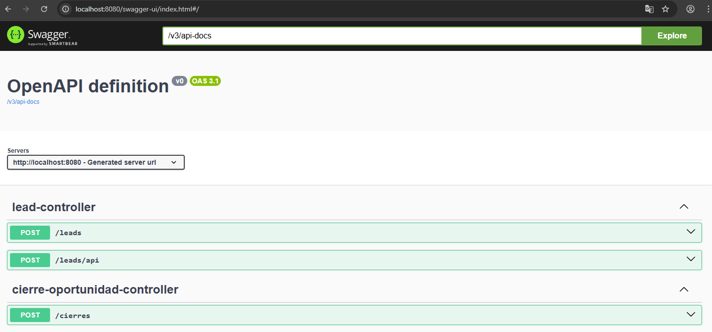
</p>


Comienzo con el **primer endpoint**:

## Endpoint  `/leads/api`

Aquí lo primero que hago es enviar una data de prueba. El JSON que envío tiene algunos campos que no cumplen con las
especificaciones del Excel que se definió como base, justamente para verificar que las validaciones funcionen bien. Así
se ve el JSON de prueba:

```json
{
  "id": "2",
  "codProveedor": "INCCCCC",
  "fechaCaptacion": "20210325 10:20",
  "ape1": "Calao",
  "ape2": "Gomez",
  "nif": "12345678Z",
  "telefono": "6000003",
  "email": "email@micorreo.es",
  "direccion": "calle de la prueba, 1",
  "codigo_postal": "28037",
  "poblacion": "MADRID",
  "provincia": "MADRID",
  "acepta1": "SI",
  "acepta2": "NO",
  "acepta3": "NO",
  "num1": "1",
  "num2": "2",
  "num3": "3",
  "dual1": "SI",
  "dual2": "NO",
  "dual3": "SI",
  "variable1": "v1",
  "variable2": "v2",
  "variable3": "v3",
  "memo": "",
  "fecha": "20210324",
  "hora": "",
  "foto1": "ruta foto1",
  "foto2": "ruta foto2",
  "comercial": "44",
  "centro": "8"
}

```

Después de hacer la prueba con estos datos, capturo la pantalla del request y la respuesta.

<p align="center">
  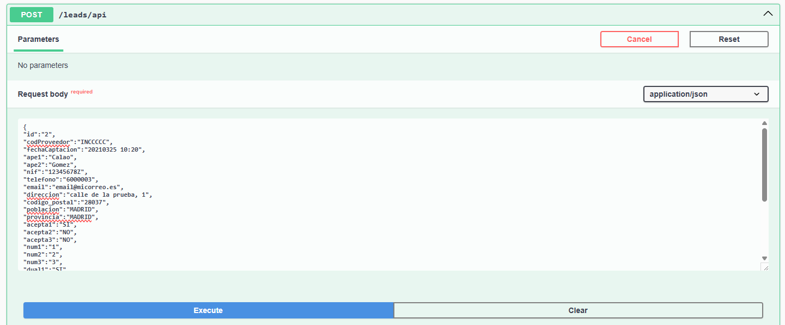
</p>

<p align="center">
  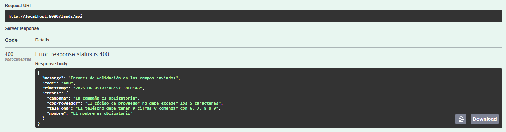
</p>

Como era de esperarse, la respuesta me devuelve un listado de errores mapeados, exactamente indicando qué campos no
cumplen, lo cual es súper útil porque así no se tiene que andar adivinando qué salió mal.

Ahora, corrijo los datos en el JSON, considerando las validaciones y los campos que pide el modelo, y vuelvo a hacer la
prueba. El JSON corregido se ve así:

```json
{
  "id": "2",
  "campana": "1",
  "codProveedor": "INC",
  "fechaCaptacion": "20210325 10:20",
  "nombre": "Alba",
  "ape1": "Calao",
  "ape2": "Gomez",
  "nif": "12345678Z",
  "telefono": "600000003",
  "email": "email@micorreo.es",
  "direccion": "calle de la prueba, 1",
  "codigo_postal": "28037",
  "poblacion": "MADRID",
  "provincia": "MADRID",
  "acepta1": "SI",
  "acepta2": "NO",
  "acepta3": "NO",
  "num1": "1",
  "num2": "2",
  "num3": "3",
  "dual1": "SI",
  "dual2": "NO",
  "dual3": "SI",
  "variable1": "v1",
  "variable2": "v2",
  "variable3": "v3",
  "memo": "",
  "fecha": "20210324",
  "hora": "",
  "foto1": "ruta foto1",
  "foto2": "ruta foto2",
  "comercial": "44",
  "centro": "8"
}
```

Vuelvo a ejecutar la llamada, y esta vez como ya pasa las validaciones recien hace el llamado a la API y obtenemos el
formato de su respuesta.

<p align="center">
  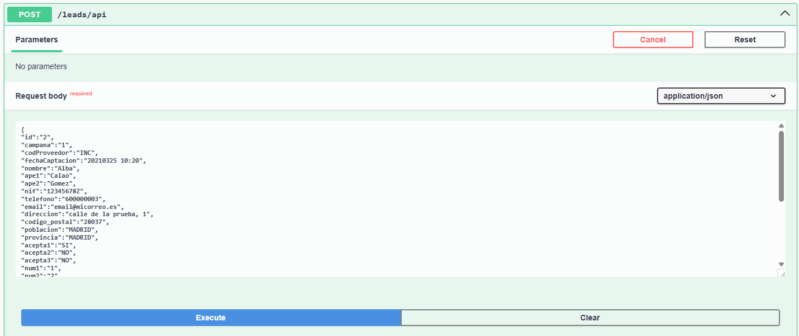
</p>

<p align="center">
  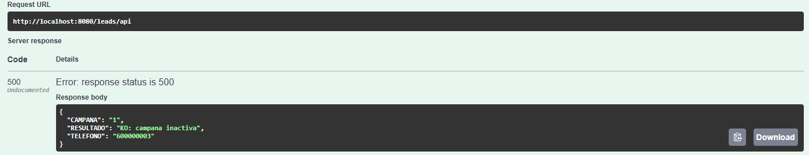
</p>

Aparte, como la respuesta fue de error reviso la base de datos y veo que se queda registrado en la tabla **LOG_WS**.
<p align="center">
  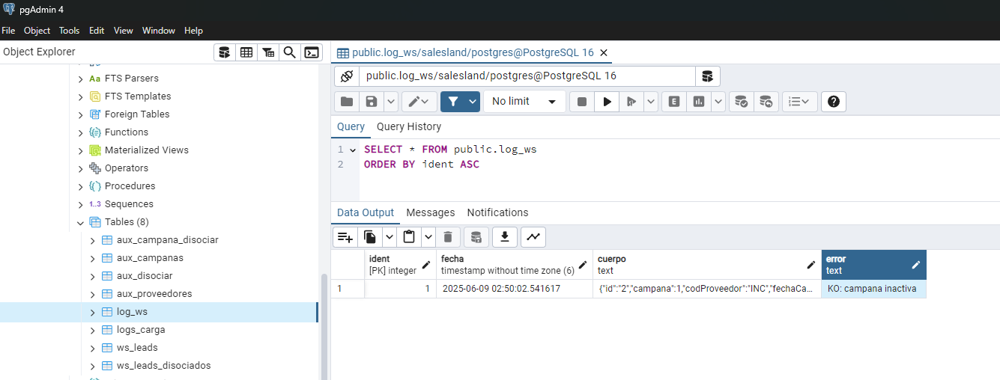
</p>

Para comprobar que cuando los datos sí están bien, se registra como carga exitosa y no como error, ahora paso a probar
el otro endpoint que creé, donde solo se validan los campos necesarios, sin las validaciones internas desconocidas del
sistema original. Este es el endpoint `/Leads`.

## Endpoint `/leads`

Aquí repito el proceso: primero envío el JSON con datos incorrectos y veo que también me devuelve los errores en una
cadena que explica exactamente qué falta o está mal.

<p align="center">
  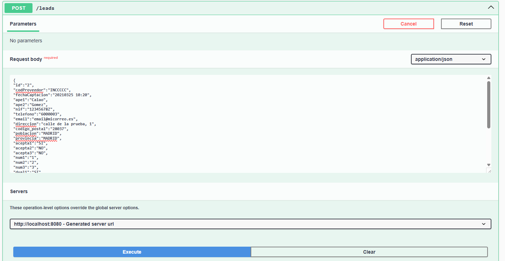
</p>
<p align="center">
  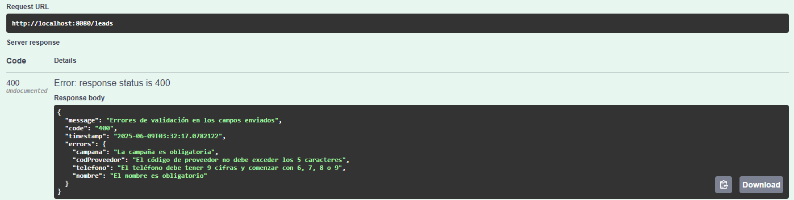
</p>

Luego vuelvo a hacer la llamada con el JSON corregido y veo que ahora sí la respuesta es **OK**, sin errores.

<p align="center">
  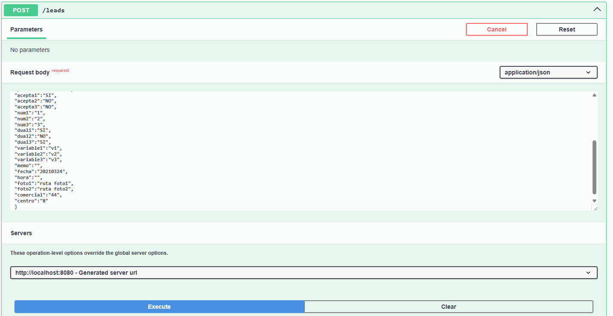
</p>
<p align="center">
  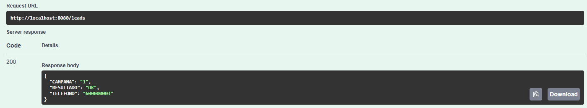
</p>

Revisando el log en Postgres, confirmo que no hay registro de error en **LOG_WS**, pero sí aparece la carga exitosa en
la otra tabla de logs, **LOGS_CARGA**.

<p align="center">
  
</p>
<p align="center">
  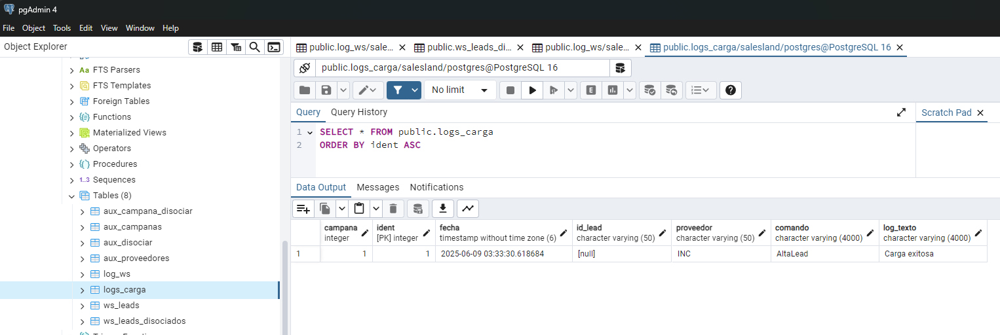
</p>

## Endpoint `/cierres`

Finalmente, para cerrar todo el flujo, también hago la prueba con el **endpoint de cierre**, `/cierres`, que se hizo
simulado porque no tengo el endpoint real. Este endpoint solo necesita un JSON muy sencillo, por ejemplo:

```json
{
  "id_oportunidad": "1",
  "descripcion": "borrar"
}
```

Al ejecutarlo, si el ID no existe, produce un error.
<p align="center">
  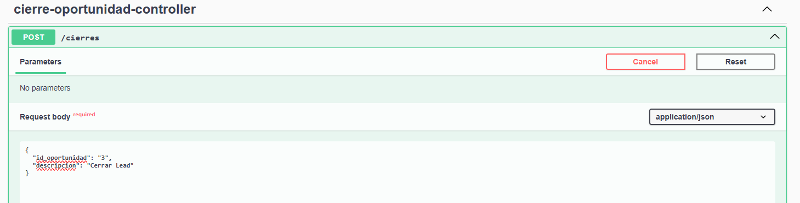
</p>
<p align="center">
  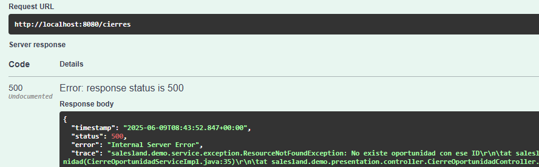
</p>

Si el ID existe, se simula correctamente el cierre del lead y se obtiene la confirmación en la respuesta.

<p align="center">
  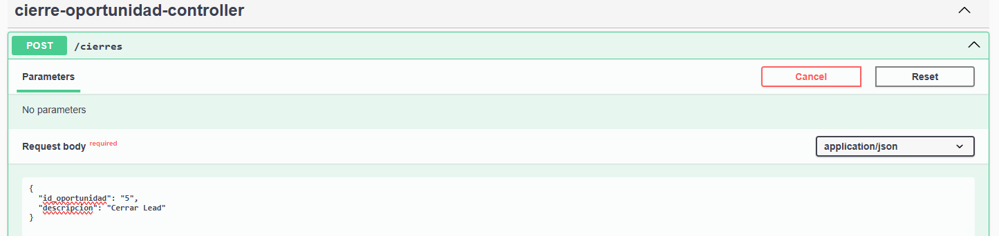
</p>
<p align="center">
  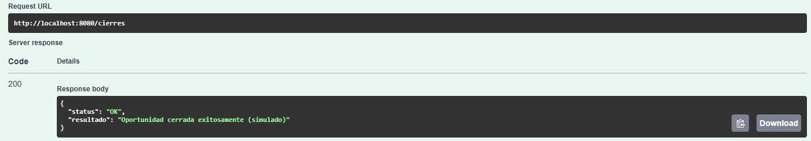
</p>


